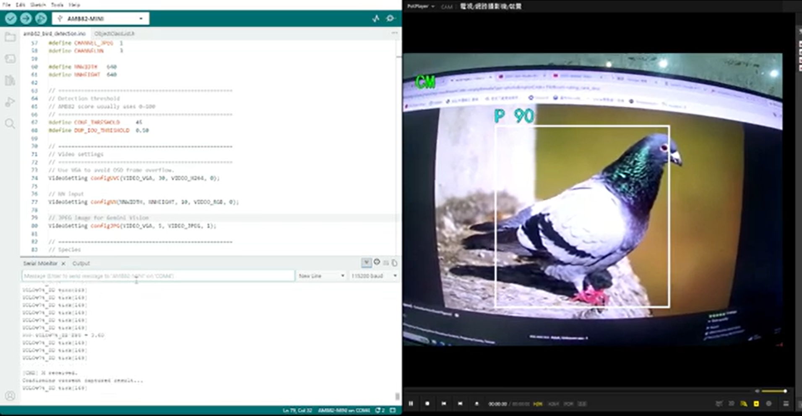

# NestEye 智慧鳥類辨識系統

### 事前工作
以下操作是從零開始的教學，也可只操作 Step 1，後續用 GitHub 附上的 yolov7 資料夾執行
- 註記：相關檔案內路徑需自行改成自己電腦的路徑，以下是需要改的檔案。
    - yolov7/data/bird.yaml
    - yolov7/01_train.txt
    - yolov7/Yolov7_reparam_scripts/reparam.txt


Step 1：至 docs/environment_setup.md，完成虛擬環境建置，以及相關套件安裝。
Step 2：至 docs/Yolov7_reparam_scripts/README.md，完成檔案遷移。
Step 3：至 configs/README.md，完成檔案遷移。
Step 4：至 weights/README.md，完成檔案遷移。
Step 5：至 docs，將 01_train.txt 移至 yolov7 資料夾內 
---
### yolob7_tiny 訓練

進入虛擬環境與 yolov7 資料夾內，並執行以下程式:
```bash
$ python train.py \
  --workers 4 \
  --device 0 \
  --batch-size 16 \
  --data data/coin_bill.yaml \
  --img 640 640 \
  --cfg cfg/training/yolov7-tiny-coinbill.yaml \
  --weights models/yolov7-tiny.pt \
  --name coin_bill_yolov7_tiny \
  --hyp data/hyp.scratch.tiny.yaml \
  --epochs 100
```

---
### 重參數化

將訓練好的 best.pt 進行重參數化，執行以下程式:
```bash
python /home/ee610/Kaiii/Edge_AI/yolov7/Yolov7_reparam_scripts/reparam_yolov7-tiny.py \
--weights "/home/ee610/Kaiii/Edge_AI/yolov7/runs/train/bird_yolov7_tiny3/weights/best.pt" \ 
--custom_yaml  /home/ee610/Kaiii/Edge_AI/yolov7/Yolov7_reparam_scripts/yolov7-tiny-deploy.yaml \
--output ../best_reparam_v6.pt
```
---
### REALTEK AMB82 AI 模型轉換

在訓練出 best.pt 並重新參數化成 best_rearam_v6.pt 後，則可以將其至 REALTEK 官網轉成最終的 yolov7_tiny.nb
- 官網：https://www.amebaiot.com/zh/amebapro2-ai-convert-model/


最後，### REALTEK AMB82 AI 模型轉換

在訓練出 best.pt 並重新參數化成 best_rearam_v6.pt 後，則可以將其至 REALTEK 官網轉成最終的 yolov7_tiny.nb
- 官網：https://www.amebaiot.com/zh/amebapro2-ai-convert-model/


最後，將 yolov7_tiny.nb 放入 NN_MDL資料夾中，即可將資料夾放入 SD 卡內

---
### 部署開發板與燒錄

將 NN_MDL/yolov7_tiny.nb 放入 SD 卡內。
進入 Arduino IDE，Tools/Board 、 Tools/Port 、 SD 卡和 Serial Monitor 115200 設定好後，將以下程式燒錄進開發板內：
- 改程式碼內的網路名稱和密碼，以及 Gemini API Key，否則無法使用雲端模式。
- amb82_bird_detection/amb82_bird_detection.ino
```cpp
/*
  AMB82 Bird Detection + Gemini Vision by GenAI.h

  Board:
  - AMB82-MINI

  Model:
  - yolov7_tiny.nb
  - SD card path:
      NN_MDL/yolov7_tiny.nb

  Viewer:
  - AMCap / PotPlayer
  - USB UVC CLASS

  Serial Monitor:
    C/c = capture current YOLO result + JPEG image
    M/m = confirm result and send image to Gemini Vision
    W/w = reconnect Wi-Fi
    I/i = show Wi-Fi status

  Classes:
    0: Columba_livia      原鴿
    1: Passer_montanus    麻雀
    2: Hirundo_rustica    家燕
*/

#include <WiFi.h>
#include "WiFiSSLClient.h"
#include "GenAI.h"

#include "StreamIO.h"
#include "VideoStream.h"
#include "UVCD.h"
#include "NNObjectDetection.h"
#include "VideoStreamOverlay.h"

#include <vector>
#include <string.h>

// ======================================================
// Wi-Fi and Gemini
// ======================================================
char WIFI_SSID[] = "----";
const char password[] = "---------";

// 建議你換成新的 Gemini API key
String Gemini_key = "----------------------";

WiFiSSLClient client;
GenAI llm;

// ======================================================
// Channel setting
// ======================================================
#define CHANNEL_UVC   0
#define CHANNEL_JPEG  1
#define CHANNELNN     3

#define NNWIDTH   640
#define NNHEIGHT  640

// ======================================================
// Detection threshold
// AMB82 score usually uses 0~100
// ======================================================
#define CONF_THRESHOLD     45
#define DUP_IOU_THRESHOLD  0.50

// ======================================================
// Video settings
// ======================================================
// Use VGA to avoid OSD frame overflow.
VideoSetting configUVC(VIDEO_VGA, 30, VIDEO_H264, 0);

// NN input
VideoSetting configNN(NNWIDTH, NNHEIGHT, 10, VIDEO_RGB, 0);

// JPEG image for Gemini Vision
VideoSetting configJPG(VIDEO_VGA, 5, VIDEO_JPEG, 1);

// ======================================================
// Species
// ======================================================
static const char* speciesEnglish[3] = {
  "Columba_livia",
  "Passer_montanus",
  "Hirundo_rustica"
};

static const char* speciesChinese[3] = {
  "原鴿",
  "麻雀",
  "家燕"
};

// OSD only uses simple ASCII.
// Do not use Chinese or underscore in OSD.
static const char* speciesOSD[3] = {
  "P",
  "S",
  "H"
};

// Offline descriptions
static const char* speciesIntro[3][5] = {
  {
    "原鴿常見於都市街道、廣場與建築物周圍，適應人類生活環境，常成群覓食與活動。",
    "原鴿主要以穀物、種子與人類環境中的食物殘渣為食，具有高度環境適應能力。",
    "原鴿飛行穩定，常在建築物、橋樑或屋簷附近棲息，並利用高處作為休息與築巢位置。",
    "原鴿具有群聚行為，常以群體方式覓食、移動與休息，提高警戒與生存機率。",
    "原鴿繁殖力強，雌雄會共同照顧雛鳥，常見於都市與郊區的人造結構附近。"
  },
  {
    "麻雀常出現在校園、公園、農地與住家附近，喜歡在地面或低矮植被間覓食。",
    "麻雀主要以種子、穀物與小型昆蟲為食，繁殖期會增加昆蟲攝食以提供雛鳥蛋白質。",
    "麻雀具有明顯群聚性，常成群覓食與活動，受到驚擾時會快速飛離並躲入樹叢。",
    "麻雀常利用建築縫隙、樹洞或人工結構築巢，是高度適應人類環境的小型鳥類。",
    "麻雀叫聲短促且頻繁，常透過鳴叫與群體互動維持警戒與聯繫。"
  },
  {
    "家燕常在開闊地區、農田、水域與建築物附近活動，擅長於空中高速飛行捕食昆蟲。",
    "家燕主要以飛行中的昆蟲為食，常低空掠過地面或水面，是典型的空中覓食鳥類。",
    "家燕常在屋簷、橋下或建築物內築巢，會使用泥土與草葉建構碗狀巢。",
    "家燕具有遷徙習性，會依季節移動至適合繁殖或覓食的地區。",
    "家燕尾羽分叉明顯，飛行靈活，常以快速轉向與滑翔方式在空中捕捉昆蟲。"
  }
};

// ======================================================
// Data structure
// ======================================================
typedef struct BirdDet {
  int classId;
  int score;
  int xmin;
  int ymin;
  int xmax;
  int ymax;
} BirdDet;

// ======================================================
// AMB82 objects
// ======================================================
Video camera_uvc;
UVCD usb_uvc;
NNObjectDetection objDet;

StreamIO videoStreamer(1, 1);
StreamIO videoStreamerNN(1, 1);

// ======================================================
// Global states
// ======================================================
volatile bool captureRequest = false;
volatile bool confirmRequest = false;

bool hasCapturedResult = false;
bool hasConfirmedResult = false;

std::vector<BirdDet> capturedResults;
int capturedClassCount[3] = {0};

// JPEG snapshot copied when C is pressed
uint8_t* capturedJpegBuf = NULL;
uint32_t capturedJpegLen = 0;
bool hasCapturedJpeg = false;

// ======================================================
// Function declarations
// ======================================================
void connectToWiFi(bool fromManualCommand);
void printWiFiStatus();

void checkSerialCommand();
void ODPostProcess(std::vector<ObjectDetectionResult> results);

void captureCurrentResult(std::vector<ObjectDetectionResult> results);
void confirmCapturedResult();

bool captureJpegSnapshot();
void releaseCapturedJpeg();

void drawInitialMessage();
void drawReviewResult();
void drawConfirmedResult();

void printReviewResult(int rawCount);
void printConfirmedResult();

String buildGeminiPrompt();
String queryGeminiByGenAI();
String getOfflineIntro(int classId);

float boxIoU(BirdDet a, BirdDet b);
void addDetectionWithSuppression(std::vector<BirdDet> &selected, BirdDet newDet);

void clampBirdBox(BirdDet &det, int im_w, int im_h);
int safeTextX(int x, int im_w);

int myMax(int a, int b);
int myMin(int a, int b);

// ======================================================
// setup
// ======================================================
void setup() {
  Serial.begin(115200);
  delay(1000);

  randomSeed(micros());

  Serial.println();
  Serial.println("======================================");
  Serial.println("AMB82 Bird Detection + GenAI Gemini");
  Serial.println("======================================");
  Serial.println("Classes:");
  Serial.println("  0: Columba_livia      原鴿");
  Serial.println("  1: Passer_montanus    麻雀");
  Serial.println("  2: Hirundo_rustica    家燕");
  Serial.println("--------------------------------------");
  Serial.println("Commands:");
  Serial.println("  C/c = capture YOLO result and JPEG");
  Serial.println("  M/m = confirm and ask Gemini Vision");
  Serial.println("  W/w = reconnect Wi-Fi");
  Serial.println("  I/i = show Wi-Fi status");
  Serial.println("======================================");

  Serial.print("UVC width = ");
  Serial.println(configUVC.width());
  Serial.print("UVC height = ");
  Serial.println(configUVC.height());

  // ======================================================
  // Camera channels
  // ======================================================
  camera_uvc.configVideoChannel(CHANNEL_UVC, configUVC);
  camera_uvc.configVideoChannel(CHANNEL_JPEG, configJPG);
  camera_uvc.configVideoChannel(CHANNELNN, configNN);

  usb_uvc.configVideo(configUVC);

  camera_uvc.videoInit();

  // ======================================================
  // Object detection
  // ======================================================
  objDet.configVideo(configNN);
  objDet.configThreshold(0.10, 0.30);
  objDet.setResultCallback(ODPostProcess);

  objDet.modelSelect(
    OBJECT_DETECTION,
    CUSTOMIZED_YOLOV7TINY,
    NA_MODEL,
    NA_MODEL
  );

  objDet.begin();

  // ======================================================
  // Camera -> USB UVC
  // ======================================================
  videoStreamer.registerInput(camera_uvc.getStream(CHANNEL_UVC));
  videoStreamer.registerOutput(usb_uvc);

  if (videoStreamer.begin() != 0) {
    Serial.println("ERROR: videoStreamer link start failed");
  } else {
    Serial.println("videoStreamer link OK");
  }

  camera_uvc.channelBegin(CHANNEL_UVC);

  // ======================================================
  // Camera -> NN
  // ======================================================
  videoStreamerNN.registerInput(camera_uvc.getStream(CHANNELNN));
  videoStreamerNN.setStackSize();
  videoStreamerNN.setTaskPriority();
  videoStreamerNN.registerOutput(objDet);

  if (videoStreamerNN.begin() != 0) {
    Serial.println("ERROR: videoStreamerNN link start failed");
  } else {
    Serial.println("videoStreamerNN link OK");
  }

  camera_uvc.channelBegin(CHANNELNN);

  // ======================================================
  // JPEG channel for Gemini
  // ======================================================
  camera_uvc.channelBegin(CHANNEL_JPEG);

  // ======================================================
  // Start USB UVC
  // ======================================================
  usb_uvc.nnbegin(
    camera_uvc.getStream(CHANNEL_UVC),
    videoStreamer.linker,
    CHANNEL_UVC,
    camera_uvc.videostream_status(CHANNEL_UVC)
  );

  // ======================================================
  // OSD
  // ======================================================
  OSD.configVideo(CHANNEL_UVC, configUVC);
  OSD.begin();

  drawInitialMessage();

  Serial.println();
  Serial.println("System Ready.");
  Serial.println("Open AMCap / PotPlayer -> USB UVC CLASS.");
  Serial.println("Type C to capture, type M to confirm.");
  Serial.println("======================================");

  connectToWiFi(false);
}

// ======================================================
// loop
// ======================================================
void loop() {
  checkSerialCommand();
  delay(20);
}

// ======================================================
// Wi-Fi
// ======================================================
void connectToWiFi(bool fromManualCommand) {
  if (strlen(WIFI_SSID) == 0) {
    Serial.println("[Wi-Fi] SSID is empty.");
    return;
  }

  if (WiFi.status() == WL_CONNECTED) {
    Serial.print("[Wi-Fi] Already connected. IP: ");
    Serial.println(WiFi.localIP());
    return;
  }

  if (fromManualCommand) {
    Serial.print("[Wi-Fi] Reconnecting to ");
  } else {
    Serial.print("[Wi-Fi] Connecting to ");
  }

  Serial.println(WIFI_SSID);

  WiFi.begin(WIFI_SSID, password);

  unsigned long startAttempt = millis();

  while (WiFi.status() != WL_CONNECTED && millis() - startAttempt < 10000) {
    delay(500);
    Serial.print(".");
  }

  Serial.println();

  if (WiFi.status() == WL_CONNECTED) {
    Serial.println("[Wi-Fi] Connected.");
    Serial.print("[Wi-Fi] IP address: ");
    Serial.println(WiFi.localIP());
  } else {
    Serial.println("[Wi-Fi] Connection failed. Offline mode will be used.");
    Serial.println("[Wi-Fi] Press W later to retry.");
  }
}

void printWiFiStatus() {
  Serial.println("--------------------------------------");
  Serial.println("[Wi-Fi STATUS]");

  if (WiFi.status() == WL_CONNECTED) {
    Serial.println("Status: Connected");
    Serial.print("SSID: ");
    Serial.println(WIFI_SSID);
    Serial.print("IP address: ");
    Serial.println(WiFi.localIP());
  } else {
    Serial.println("Status: Not connected");
    Serial.print("Configured SSID: ");
    Serial.println(WIFI_SSID);
  }

  Serial.println("--------------------------------------");
}

// ======================================================
// Serial commands
// ======================================================
void checkSerialCommand() {
  while (Serial.available() > 0) {
    char cmd = Serial.read();

    if (cmd == 'C' || cmd == 'c') {
      captureRequest = true;
      hasConfirmedResult = false;

      Serial.println();
      Serial.println("[CMD] C received.");
      Serial.println("Capturing next NN result and JPEG...");
    }

    else if (cmd == 'M' || cmd == 'm') {
      if (!hasCapturedResult) {
        Serial.println();
        Serial.println("[CMD] M received, but no captured result.");
        Serial.println("Please type C first.");
      } else {
        confirmRequest = true;

        Serial.println();
        Serial.println("[CMD] M received.");
        Serial.println("Confirming current captured result...");
      }
    }

    else if (cmd == 'W' || cmd == 'w') {
      Serial.println();
      Serial.println("[CMD] W received.");
      connectToWiFi(true);
    }

    else if (cmd == 'I' || cmd == 'i') {
      Serial.println();
      Serial.println("[CMD] I received.");
      printWiFiStatus();
    }

    else if (cmd == '\n' || cmd == '\r') {
      // ignore
    }

    else {
      Serial.print("Unknown command: ");
      Serial.println(cmd);
      Serial.println("Use C, M, W, or I.");
    }
  }
}

// ======================================================
// NN callback
// ======================================================
void ODPostProcess(std::vector<ObjectDetectionResult> results) {
  if (captureRequest) {
    captureRequest = false;

    captureCurrentResult(results);

    if (WiFi.status() == WL_CONNECTED &&
        Gemini_key.length() > 0 &&
        Gemini_key != "PASTE_YOUR_NEW_GEMINI_API_KEY_HERE") {

      if (captureJpegSnapshot()) {
        Serial.print("[JPEG] Captured snapshot, bytes = ");
        Serial.println(capturedJpegLen);
      } else {
        Serial.println("[JPEG] Capture failed. Offline intro will be used.");
      }
    } else {
      releaseCapturedJpeg();
      Serial.println("[JPEG] Wi-Fi or Gemini key not ready. Offline intro will be used.");
    }

    drawReviewResult();
    printReviewResult(objDet.getResultCount());
    return;
  }

  if (confirmRequest) {
    confirmRequest = false;

    confirmCapturedResult();
    drawConfirmedResult();
    printConfirmedResult();
    return;
  }
}

// ======================================================
// Capture NN result
// ======================================================
void captureCurrentResult(std::vector<ObjectDetectionResult> results) {
  uint16_t im_h = configUVC.height();
  uint16_t im_w = configUVC.width();

  int resultCount = objDet.getResultCount();
  std::vector<BirdDet> selected;

  if (resultCount > 0) {
    for (int i = 0; i < resultCount; i++) {
      ObjectDetectionResult item = results[i];

      int classId = item.type();
      int score = item.score();

      if (classId < 0 || classId >= 3) {
        continue;
      }

      if (score < CONF_THRESHOLD) {
        continue;
      }

      BirdDet det;
      det.classId = classId;
      det.score = score;

      det.xmin = (int)(item.xMin() * im_w);
      det.xmax = (int)(item.xMax() * im_w);
      det.ymin = (int)(item.yMin() * im_h);
      det.ymax = (int)(item.yMax() * im_h);

      clampBirdBox(det, im_w, im_h);
      addDetectionWithSuppression(selected, det);
    }
  }

  capturedResults = selected;

  for (int i = 0; i < 3; i++) {
    capturedClassCount[i] = 0;
  }

  for (size_t i = 0; i < capturedResults.size(); i++) {
    int classId = capturedResults[i].classId;

    if (classId >= 0 && classId < 3) {
      capturedClassCount[classId]++;
    }
  }

  hasCapturedResult = true;
  hasConfirmedResult = false;
}

void confirmCapturedResult() {
  hasConfirmedResult = true;
}

// ======================================================
// JPEG snapshot
// ======================================================
void releaseCapturedJpeg() {
  if (capturedJpegBuf != NULL) {
    free(capturedJpegBuf);
    capturedJpegBuf = NULL;
  }

  capturedJpegLen = 0;
  hasCapturedJpeg = false;
}

bool captureJpegSnapshot() {
  releaseCapturedJpeg();

  uint32_t img_addr = 0;
  uint32_t img_len = 0;

  camera_uvc.getImage(CHANNEL_JPEG, &img_addr, &img_len);

  if (img_addr == 0 || img_len == 0) {
    Serial.println("[JPEG] getImage returned empty image.");
    return false;
  }

  capturedJpegBuf = (uint8_t*)malloc(img_len);

  if (capturedJpegBuf == NULL) {
    Serial.print("[JPEG] malloc failed, bytes = ");
    Serial.println(img_len);
    capturedJpegLen = 0;
    hasCapturedJpeg = false;
    return false;
  }

  memcpy(capturedJpegBuf, (void*)img_addr, img_len);

  capturedJpegLen = img_len;
  hasCapturedJpeg = true;

  return true;
}

// ======================================================
// Gemini by GenAI.h
// ======================================================
String buildGeminiPrompt() {
  String prompt = "這張圖片已由 AMB82-MINI 的 YOLOv7-tiny 初步辨識出：";

  bool any = false;

  for (int i = 0; i < 3; i++) {
    if (capturedClassCount[i] > 0) {
      any = true;

      prompt += speciesEnglish[i];
      prompt += "（";
      prompt += speciesChinese[i];
      prompt += "）";
      prompt += String(capturedClassCount[i]);
      prompt += "隻；";
    }
  }

  if (!any) {
    prompt += "沒有偵測到有效鳥類；";
  }

  prompt += "請根據圖片內容判斷鳥所處環境、正在做什麼，並補充牠的習性。";
  prompt += "請使用繁體中文，50字以內，不要條列。";

  return prompt;
}

String queryGeminiByGenAI() {
  if (WiFi.status() != WL_CONNECTED) {
    Serial.println("[Gemini] Wi-Fi not connected.");
    return "";
  }

  if (Gemini_key.length() == 0 ||
      Gemini_key == "PASTE_YOUR_NEW_GEMINI_API_KEY_HERE") {
    Serial.println("[Gemini] API key not set.");
    return "";
  }

  if (!hasCapturedJpeg || capturedJpegBuf == NULL || capturedJpegLen == 0) {
    Serial.println("[Gemini] No JPEG snapshot.");
    return "";
  }

  String prompt_msg = buildGeminiPrompt();

  Serial.println("[Gemini] Prompt:");
  Serial.println(prompt_msg);

  Serial.println("[Gemini] Calling llm.geminivision()...");

  String response = llm.geminivision(
    Gemini_key,
    "gemini-2.5-flash",
    prompt_msg,
    (uint32_t)capturedJpegBuf,
    capturedJpegLen,
    client
  );

  response.trim();

  if (response.length() == 0) {
    Serial.println("[Gemini] Empty response. Offline intro will be used.");
  }

  return response;
}

// ======================================================
// OSD drawing
// ======================================================
void drawInitialMessage() {
  OSD.createBitmap(CHANNEL_UVC);

  OSD.drawText(
    CHANNEL_UVC,
    20,
    30,
    "C",
    OSD_COLOR_GREEN
  );

  OSD.update(CHANNEL_UVC);
}

void drawReviewResult() {
  OSD.createBitmap(CHANNEL_UVC);

  int im_w = configUVC.width();

  for (size_t i = 0; i < capturedResults.size(); i++) {
    BirdDet det = capturedResults[i];

    int classId = det.classId;
    int score = det.score;

    OSD.drawRect(
      CHANNEL_UVC,
      det.xmin,
      det.ymin,
      det.xmax,
      det.ymax,
      3,
      OSD_COLOR_WHITE
    );

    char text_str[16];
    snprintf(text_str, sizeof(text_str), "%s %d", speciesOSD[classId], score);

    int textX = safeTextX(det.xmin, im_w);
    int textY = det.ymin - OSD.getTextHeight(CHANNEL_UVC);

    if (textY < 0) {
      textY = det.ymin + 5;
    }

    OSD.drawText(
      CHANNEL_UVC,
      textX,
      textY,
      text_str,
      OSD_COLOR_CYAN
    );
  }

  OSD.drawText(
    CHANNEL_UVC,
    20,
    30,
    "CM",
    OSD_COLOR_GREEN
  );

  OSD.update(CHANNEL_UVC);
}

void drawConfirmedResult() {
  OSD.createBitmap(CHANNEL_UVC);

  int im_w = configUVC.width();

  for (size_t i = 0; i < capturedResults.size(); i++) {
    BirdDet det = capturedResults[i];

    int classId = det.classId;
    int score = det.score;

    OSD.drawRect(
      CHANNEL_UVC,
      det.xmin,
      det.ymin,
      det.xmax,
      det.ymax,
      3,
      OSD_COLOR_WHITE
    );

    char text_str[16];
    snprintf(text_str, sizeof(text_str), "%s %d", speciesOSD[classId], score);

    int textX = safeTextX(det.xmin, im_w);
    int textY = det.ymin - OSD.getTextHeight(CHANNEL_UVC);

    if (textY < 0) {
      textY = det.ymin + 5;
    }

    OSD.drawText(
      CHANNEL_UVC,
      textX,
      textY,
      text_str,
      OSD_COLOR_CYAN
    );
  }

  char summary[32] = "";
  char tmp[8];

  for (int i = 0; i < 3; i++) {
    if (capturedClassCount[i] > 0) {
      snprintf(tmp, sizeof(tmp), "%s%d ", speciesOSD[i], capturedClassCount[i]);
      strncat(summary, tmp, sizeof(summary) - strlen(summary) - 1);
    }
  }

  if (strlen(summary) == 0) {
    snprintf(summary, sizeof(summary), "N0");
  }

  OSD.drawText(
    CHANNEL_UVC,
    20,
    30,
    summary,
    OSD_COLOR_GREEN
  );

  OSD.update(CHANNEL_UVC);
}

// ======================================================
// Serial output
// ======================================================
void printReviewResult(int rawCount) {
  Serial.println("--------------------------------------");
  Serial.println("[CAPTURED - REVIEW]");

  Serial.print("Raw Result Count: ");
  Serial.println(rawCount);

  Serial.print("Captured Valid Count: ");
  Serial.println(capturedResults.size());

  Serial.println("Detected Birds:");

  if (capturedResults.size() == 0) {
    Serial.println("  No valid bird detected.");
  }

  for (size_t i = 0; i < capturedResults.size(); i++) {
    int classId = capturedResults[i].classId;

    Serial.print("  ");
    Serial.print(speciesEnglish[classId]);
    Serial.print(" ");
    Serial.print(speciesChinese[classId]);
    Serial.print(" score=");
    Serial.println(capturedResults[i].score);
  }

  Serial.println("If result is bad, type C again.");
  Serial.println("If result is correct, type M to confirm.");
  Serial.println("--------------------------------------");
}

void printConfirmedResult() {
  Serial.println("--------------------------------------");
  Serial.println("[CONFIRMED RESULT]");

  Serial.print("Captured Valid Count: ");
  Serial.println(capturedResults.size());

  if (capturedResults.size() == 0) {
    Serial.println("No valid bird detected.");
    Serial.println("--------------------------------------");
    return;
  }

  for (int i = 0; i < 3; i++) {
    if (capturedClassCount[i] > 0) {
      Serial.print(speciesEnglish[i]);
      Serial.print(" ");
      Serial.print(speciesChinese[i]);
      Serial.print(" ");
      Serial.print(capturedClassCount[i]);
      Serial.println("隻");
    }
  }

  String geminiText = "";

  if (WiFi.status() == WL_CONNECTED &&
      Gemini_key.length() > 0 &&
      Gemini_key != "PASTE_YOUR_NEW_GEMINI_API_KEY_HERE" &&
      hasCapturedJpeg) {

    Serial.println("Querying Gemini Vision by GenAI.h...");
    geminiText = queryGeminiByGenAI();
  }

  if (geminiText.length() > 0) {
    Serial.print("Gemini：");
    Serial.println(geminiText);
  } else {
    Serial.println("Gemini unavailable. Use offline intro:");

    for (int i = 0; i < 3; i++) {
      if (capturedClassCount[i] > 0) {
        Serial.print(speciesChinese[i]);
        Serial.print("介紹：");
        Serial.println(getOfflineIntro(i));
      }
    }
  }

  Serial.println("--------------------------------------");
}

// ======================================================
// Offline intro
// ======================================================
String getOfflineIntro(int classId) {
  if (classId < 0 || classId >= 3) {
    return String("");
  }

  int idx = random(0, 5);
  return String(speciesIntro[classId][idx]);
}

// ======================================================
// Box helper
// ======================================================
void clampBirdBox(BirdDet &det, int im_w, int im_h) {
  if (im_w < 2 || im_h < 2) {
    return;
  }

  if (det.xmin < 0) det.xmin = 0;
  if (det.ymin < 0) det.ymin = 0;

  if (det.xmin >= im_w - 1) det.xmin = im_w - 2;
  if (det.ymin >= im_h - 1) det.ymin = im_h - 2;

  if (det.xmax < 1) det.xmax = 1;
  if (det.ymax < 1) det.ymax = 1;

  if (det.xmax >= im_w) det.xmax = im_w - 1;
  if (det.ymax >= im_h) det.ymax = im_h - 1;

  if (det.xmax <= det.xmin) {
    det.xmax = det.xmin + 1;

    if (det.xmax >= im_w) {
      det.xmax = im_w - 1;
      det.xmin = im_w - 2;
    }
  }

  if (det.ymax <= det.ymin) {
    det.ymax = det.ymin + 1;

    if (det.ymax >= im_h) {
      det.ymax = im_h - 1;
      det.ymin = im_h - 2;
    }
  }
}

int safeTextX(int x, int im_w) {
  int safeMargin = 80;

  if (x < 0) {
    return 0;
  }

  if (x > im_w - safeMargin) {
    return im_w - safeMargin;
  }

  return x;
}

float boxIoU(BirdDet a, BirdDet b) {
  int interX1 = myMax(a.xmin, b.xmin);
  int interY1 = myMax(a.ymin, b.ymin);
  int interX2 = myMin(a.xmax, b.xmax);
  int interY2 = myMin(a.ymax, b.ymax);

  int interW = interX2 - interX1;
  int interH = interY2 - interY1;

  if (interW <= 0 || interH <= 0) {
    return 0.0f;
  }

  float interArea = (float)interW * (float)interH;

  float areaA = (float)(a.xmax - a.xmin) * (float)(a.ymax - a.ymin);
  float areaB = (float)(b.xmax - b.xmin) * (float)(b.ymax - b.ymin);

  float unionArea = areaA + areaB - interArea;

  if (unionArea <= 0.0f) {
    return 0.0f;
  }

  return interArea / unionArea;
}

void addDetectionWithSuppression(std::vector<BirdDet> &selected, BirdDet newDet) {
  for (size_t i = 0; i < selected.size(); i++) {
    float iou = boxIoU(selected[i], newDet);

    if (iou >= DUP_IOU_THRESHOLD) {
      if (newDet.score > selected[i].score) {
        selected[i] = newDet;
      }
      return;
    }
  }

  selected.push_back(newDet);
}

int myMax(int a, int b) {
  return (a > b) ? a : b;
}

int myMin(int a, int b) {
  return (a < b) ? a : b;
}
```

---
特殊指令篇：
本系統透過 Serial Monitor 提供特殊指令操作，使使用者能在不重新燒錄程式的情況下，直接控制鳥類辨識流程。


---

